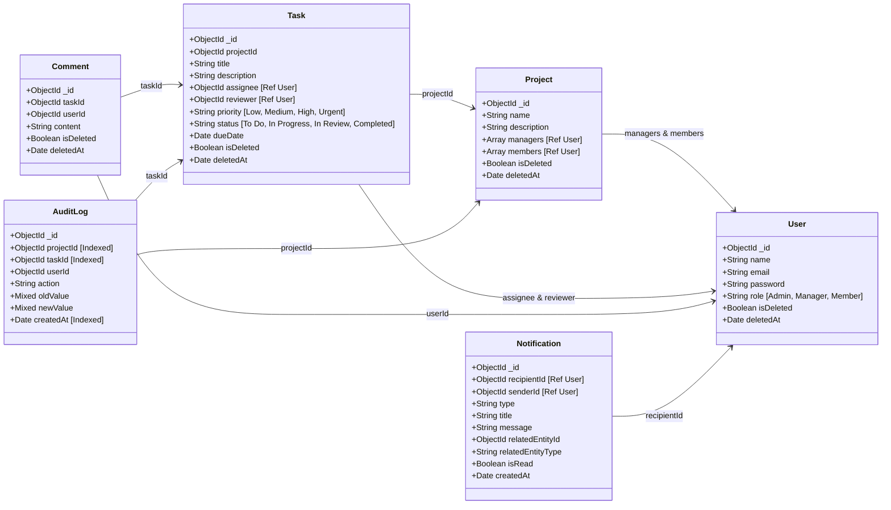

# TÀI LIỆU KIẾN TRÚC HỆ THỐNG - WORKFLOW TRACKER

Tài liệu này được biên soạn dựa trên các ý kiến chỉ đạo và đóng góp chuyên môn cực kỳ chuẩn xác của **Technical Lead**. Đây là bộ quy chuẩn kiến trúc cốt lõi của dự án nhằm đảm bảo hệ thống vận hành mượt mà, bảo mật, tối ưu hiệu năng và không gặp lỗi logic khi chạy thực tế (Production).

---

## 1. GIẢI QUYẾT LỖI LOGIC CỐT LÕI (CRITICAL LOGICAL FLAWS)

### 🚨 A. Phân Quyền Kết Hợp RBAC & Resource-Based Access Control (ABAC)
*   **Vấn đề:** Nếu chỉ dùng Middleware check Role dạng `checkRole('Manager')`, một Manager của phòng ban/dự án A hoàn toàn có thể sửa/xóa dự án của Manager phòng ban B.
*   **Giải pháp:** 
    *   **Project Model** sẽ lưu một mảng `managers: [{ type: Schema.Types.ObjectId, ref: 'User' }]`.
    *   **Middleware ủy quyền (Authorization Middleware)** sẽ thực hiện kiểm tra 2 lớp:
        1.  **Lớp 1 (RBAC):** Người dùng có phải là `Admin` hoặc `Manager` hay không?
        2.  **Lớp 2 (Resource-Based):** Nếu là `Manager`, hệ thống sẽ truy vấn Dự án và kiểm tra xem `req.user.id` có nằm trong mảng `managers` của Dự án đó hay không. Chỉ khi thỏa mãn mới được quyền Thêm/Sửa/Xóa Dự án hoặc các Task thuộc Dự án đó.

### 🔄 B. Luồng Vòng Đời Task & Xử Lý "Rejected" (Rejection Flow)
*   **Vấn đề:** Trạng thái `Rejected` nếu là trạng thái cuối cùng (End-state) sẽ làm tắc nghẽn tiến trình công việc, mất tính liên tục và hỏng báo cáo tiến độ.
*   **Giải pháp:** 
    *   Trạng thái `Rejected` **không phải là trạng thái cuối cùng**.
    *   Khi Manager thực hiện hành động **Từ chối (Reject)**, hệ thống yêu cầu:
        1.  Bắt buộc nhập **Lý do từ chối** (Sẽ được tự động tạo thành một bản ghi trong `Comment` của Task đó).
        2.  Trạng thái của Task tự động chuyển ngược lại về `In Progress` (hoặc `To Do`) để Member tiếp tục chỉnh sửa.
        3.  Ghi nhận hành động `REJECT_TASK` vào `AuditLog`.

---

## 2. THIẾT KẾ ĐỂ VẬN HÀNH THỰC TẾ (REAL-WORLD USABILITY)

### 🗑️ A. Cơ Chế Xóa Mềm (Soft Delete)
*   **Vấn đề:** Tránh mất mát dữ liệu đối soát lịch sử (Audit Log, Tasks, Comments) khi người dùng lỡ tay xóa Dự án/Task.
*   **Giải pháp:**
    *   Thêm hai thuộc tính `{ isDeleted: Boolean, deletedAt: Date }` vào **tất cả các Schema**.
    *   Khi thực hiện xóa (Delete API), chỉ cập nhật `isDeleted: true` và `deletedAt: new Date()`.
    *   Viết Mongoose Query Middleware (`pre('find')`, `pre('findOne')`, `pre('findOneAndUpdate')`) để tự động lọc bỏ các bản ghi đã xóa mềm (trừ khi Admin yêu cầu khôi phục).

### 📭 B. Hệ Thống Thông Báo Realtime & Email (Notification System)
*   **Vấn đề:** Các thành viên cần được thông báo ngay lập tức khi có thay đổi trạng thái, bình luận mới hoặc gán việc mà không cần F5 trình duyệt.
*   **Giải pháp:**
    *   Xây dựng **Notification Model** để lưu trữ thông báo.
    *   Tích hợp **Socket.io** để phát thông báo thời gian thực (Realtime Notification) trên Web Frontend.
    *   Gửi **Email Notification** (sử dụng Nodemailer/SendGrid) cho các sự kiện quan trọng như: được giao task mới, task bị từ chối, hoặc đến hạn chót (Due Date).

---

## 3. TỐI ƯU HÓA CƠ SỞ DỮ LIỆU MONGODB

### 💬 A. Tách Biệt Model Comment (Reference vs Embedded)
*   **Thiết kế:** Tuyệt đối không nhúng mảng `comments: []` trực tiếp vào Task document vì giới hạn dung lượng 16MB của MongoDB và làm chậm truy vấn Task.
*   **Giải pháp:** Tạo model riêng biệt `models/Comment.js` liên kết với Task qua `taskId` (khóa ngoại).

### 📈 B. Đánh Chỉ Mục (Index) Cho Audit Log
*   Nhật ký hệ thống sẽ tăng trưởng rất nhanh. Để tránh tình trạng treo/timeout khi Manager truy vấn báo cáo log, các trường sau bắt buộc phải được đánh chỉ mục (**Index**):
    *   `projectId` (Đánh chỉ mục đơn)
    *   `taskId` (Đánh chỉ mục đơn)
    *   `createdAt` (Để sắp xếp log mới nhất lên đầu nhanh chóng)

---

## 4. CHI TIẾT CẤU TRÚC CÁC MODEL (MONGOOSE SCHEMAS)

---
*Tài liệu này là kim chỉ nam cho toàn bộ quá trình phát triển mã nguồn của dự án.*
